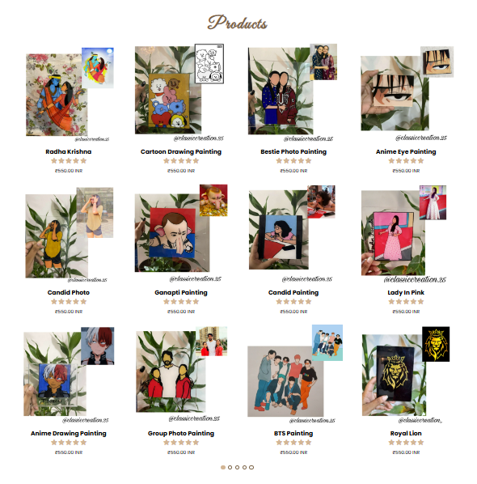

# Classic Creation System

## Overview
Classic Creation System is a comprehensive web-based platform designed to offer a unique and customizable experience in glass painting. 
It provides users with the ability to browse various products, place orders, and manage their accounts. 
Admins have the capability to manage products, users, and orders efficiently, ensuring smooth operation of the platform.

## Features
- **User Registration and Authentication:** Users can create an account, log in, and log out securely. 
- **Product Browsing:** Users can browse through a variety of glass painting products.
- **Order Placement:** Users can place orders for products, with the system handling the order processing and tracking.
- **Admin Management:** Admins have the authority to manage the product listings and user accounts.
- **Payment Integration:** The platform integrates with Razorpay for secure and seamless payment transactions.

## Screenshots
### User Interface

### Admin Dashboard

### Product Page

### Order Placement

## User Functionalities
1. **Register and Log In:**
    - Users can register for an account using their email address and password.
    - After registration, users can log in to their account to access the platform's features.
2. **Browse and View Products:**
    - Users can browse the available glass painting products, view product details, and choose items to order.
3. **Place Orders:**
    - Users can place orders for selected products. The system processes the order and updates the order status.
4. **View Order History:**
    - Users can view their past orders and track the status of their current orders.

## Admin Functionalities
1. **Log In:**
    - Admins can log in using their admin credentials.
2. **Manage Products:**
    - Admins can add new products, edit existing product details, and delete products from the listings.
3. **Manage Users:**
    - Admins can view user accounts, edit user information, and delete user accounts if necessary.
4. **Manage Orders:**
    - Admins can view and update the status of orders, ensuring timely processing and delivery.

## Technologies Used
- **Frontend:** HTML, CSS, JavaScript, Bootstrap, jQuery
- **Backend:** Node.js
- **Database:** MySQL (Managed with XAMPP and phpMyAdmin)
- **Payment Gateway:** Razorpay
- **Development Tools:** Visual Studio Code, Chrome DevTools, MySQL Workbench

## Future Work
- **Email Verification:** Implement email verification for user registration to enhance security.
- **Customization Features:** Allow users to upload photos for customization of glass paintings and provide a preview of the customized product.
- **Enhanced Admin Panel:** Develop a more robust admin panel with advanced management features.
- **User Interface Improvements:** Continuously improve the user interface for a better user experience.
